  
  
  
  <!-- Add once your portfolio is live:
  
  -->

I've spent 5+ years shipping production web software from Jaipur. Most recently I was lead developer on **Zonov**, a multi-tenant hospital information system at Growit.ai, working across Django REST APIs, a React 19 and TypeScript frontend, tenant-aware access control, and OCR and LLM document workflows. Before that I built fintech SaaS products at Formidium for three and a half years, and 50+ client websites at i3Techs.

Right now I'm building AI tools in public, starting with [Job-Agent](https://github.com/tarunsinghgohil/Job-Agent).

## What I've built

<table>
<tr>
<td width="50%" valign="top">

**Zonov**, hospital information system 
Growit.ai, 2025–2026

Multi-tenant, AI-enabled HIMS covering OPD, IPD, emergency, lab, radiology, pharmacy, billing and NABH workflows. I built DRF APIs with JWT auth and tenant-scoped permissions, the React frontend, and OCR plus LLM extraction for clinical documents.

Python, Django REST Framework, MySQL, MongoDB, Redis, React 19, TypeScript, Docker, AWS

</td>
<td width="50%" valign="top">

**Fintech SaaS dashboards** 
Formidium, 2022–2025

Looked after 12+ production applications. Built KPI and financial dashboards, reusable React and TypeScript components, and Python scripts that replaced manual reporting steps. Cut load times with code splitting, lazy loading and caching.

React, TypeScript, Redux Toolkit, Recharts, Python, Django, REST APIs

</td>
</tr>
<tr>
<td width="50%" valign="top">

**RetailX**, retail ERP

POS billing, inventory and reporting with role-based access, built for data consistency on busy screens.

React, TypeScript, Redux Toolkit, Tailwind, Node.js, Express, MongoDB

</td>
<td width="50%" valign="top">

**Charge My EV**, EV charging platform

Customer-facing charging flows across web and mobile, backed by REST APIs.

React Native, React, Node.js, Express, MongoDB

</td>
</tr>
</table>

These are employer products, so the code is private. I'm happy to walk through the architecture in an interview.

### Open source

| Project | What it is | Stack |
|---|---|---|
| [Job-Agent](https://github.com/tarunsinghgohil/Job-Agent) | An AI agent that helps with the job search. Work in progress. | Python |
<!-- Add a row for each new project as you publish it, for example:
| [django-tenant-rbac](https://github.com/tarunsinghgohil/django-tenant-rbac) | Multi-tenant Django REST starter with JWT, tenant-scoped permissions and tests | Django, DRF, PostgreSQL, pytest |
| [docuflow-rag](https://github.com/tarunsinghgohil/docuflow-rag) | Upload a PDF or scan, get validated JSON and grounded answers | FastAPI, OCR, embeddings, OpenAI |
-->

## Stack

| | |
|---|---|
| Backend |  |
| Frontend |  |
| AI |       |
| Data |  |
| Cloud and tooling |  |

## Activity

  
  

  
  

<picture>
  <source media="(prefers-color-scheme: dark)" srcset="https://raw.githubusercontent.com/tarunsinghgohil/tarunsinghgohil/output/snake-dark.svg"/>
  <source media="(prefers-color-scheme: light)" srcset="https://raw.githubusercontent.com/tarunsinghgohil/tarunsinghgohil/output/snake-light.svg"/>
  
</picture>

The banner and the commit dashboard are drawn by <a href="./scripts">two small Python scripts</a> in this repo (standard library only). GitHub Actions rebuilds the dashboard every morning.
