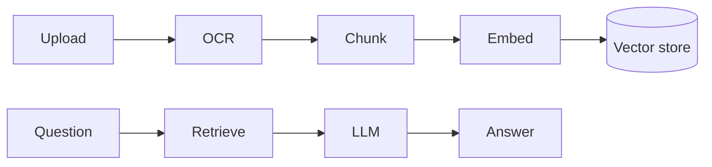

# GitHub profile setup guide

Everything here takes about 30 minutes, apart from building the new projects in part 4.

## 1. Publish the profile README

GitHub shows a README on your profile when a public repo has exactly the same name as your username.

1. Create a new **public** repository named `tarunsinghgohil`.
2. Unzip `tarunsinghgohil-profile.zip` and push its contents. The `.github` folder is hidden on macOS and Windows, and the web uploader can miss it, so use git:

```bash
git clone https://github.com/tarunsinghgohil/tarunsinghgohil.git
cd tarunsinghgohil
# copy everything from the unzipped folder in here, including .github/
git add .
git commit -m "Profile README with dashboard"
git push
```

3. In the repo, go to **Settings → Actions → General → Workflow permissions**, choose **Read and write permissions**, and save. The workflows commit the refreshed images back to the repo.

## 2. Add the token for private stats and the metrics visuals

Most of your work lives in private repos, so the cards need a token that can see it.

1. Go to **Settings → Developer settings → Personal access tokens → Tokens (classic) → Generate new token (classic)**.
2. Tick `repo` and `read:user`. Set the expiry to a year and put a reminder in your calendar, because an expired token is the usual reason these cards stop updating.
3. In the `tarunsinghgohil` repo, open **Settings → Secrets and variables → Actions** (the Actions tab, not Dependabot or Codespaces), click **New repository secret**, name it `METRICS_TOKEN`, and paste the token.

Without this secret the dashboard and stats cards still work with public data, and the two metrics visuals are skipped.

## 3. Run the workflows once

Open the **Actions** tab, enable workflows if GitHub asks, then:

1. Select **Profile dashboard → Run workflow**. It takes 3 to 5 minutes.
2. Select **Contribution snake → Run workflow**. This creates the `output` branch the snake image is served from.

After that both run every morning on their own. Until the first run finishes, the dashboard images on your profile show as broken; that's expected.

## 4. Profile settings

Open **Settings → Public profile**.

- **Name:** `Tarun Singh Gohil`. It currently shows `tarungohil80`, and recruiters search by name.
- **Photo:** a clear headshot. The default pattern avatar makes the account look new or unused.
- **Bio** (156 of 160 characters): `Full-stack & AI engineer. Python, Django, FastAPI, React, TypeScript, LLM and RAG features. 5+ years shipping SaaS in healthcare and fintech. Open to roles.`
- **Public email:** `tarungohil80@gmail.com`. Don't put your phone number anywhere on GitHub; scrapers collect it.
- **URL:** your portfolio once it's live, otherwise LinkedIn.
- **Social accounts:** add LinkedIn.
- **Contributions & activity:** tick **Include private contributions on my profile**. This is what the blue banner on your profile is asking for. Commits to private repos, such as Job-Agent, then show up as green squares with the repo names hidden, and your locked achievements appear.
- **Status** (click your avatar on the profile page): `Open to full-stack and AI engineering roles`.

## 5. Pins and repo hygiene

On your profile, click **Customize your pins**. Right now GitHub is showing its default "Popular repositories", which are all HTML and JavaScript landing pages. None of them shows the Python, Django or AI work your resumes lead with.

Pin in this order as the projects exist: Job-Agent, the two new builds below, your strongest React and TypeScript project (fakeshop or Shipping-box if the code is solid), and portfolio once it's upgraded.

For every public repo:

- Write a one-line description. `portfolio`, `hotel-nakshatra` and `Tallento.ai` have none.
- Add topics (`django`, `fastapi`, `react`, `llm`, `rag`, and so on) and a live demo link in the About panel.
- Rename vague names. `virtual` doesn't tell anyone what it is. GitHub redirects old links after a rename.
- Make practice clones and abandoned experiments private or archive them. Eighteen repos where six are strong beats eighteen where six are weak.

## 6. What each pinned repo's README needs

````markdown
# Project name
One sentence on what it does and who it's for.

            <- a 10 to 20 second screen recording
Live demo: https://...            <- Vercel, Render, Railway or Hugging Face Spaces

## Why I built it
Two or three sentences on the problem.

## How it works


## Run it locally
docker compose up

## Tests
pytest     <- plus a CI badge at the top from GitHub Actions

## What I'd do next
````

Add a GitHub Actions workflow that runs your tests on every push in each project. A green CI badge is one of the quickest trust signals for a reviewer.

## 7. Projects to build next

Your resumes describe Python, Django REST Framework, FastAPI, RAG, Whisper and agent frameworks. Your public repos don't show any of it yet. These three close that gap without touching employer code. Don't upload anything from Zonov, RetailX or Formidium; that code belongs to your employers. Rebuild the ideas from scratch with synthetic data.

1. **Job-Agent (make it public).** It's already on your profile as a private repo from 26 Sep. Rebuild the flow in LangGraph (tools, state, a human-approval step before anything is sent) so the LangGraph claim on your resume has code behind it. Remove any API keys, cookies or personal data from the full git history before you make it public.
2. **django-tenant-rbac.** A small multi-tenant Django REST starter: JWT auth, tenant-scoped querysets, role permissions, OpenAPI docs, pytest coverage, Docker Compose, CI. This is the Zonov experience shown in a form anyone can read.
3. **docuflow-rag.** FastAPI service: upload a PDF or scanned form, OCR it, extract fields into schema-validated JSON, and answer questions grounded in the document with citations. Add a Faster-Whisper endpoint for voice notes. Small React frontend, deployed demo.

A realistic pace is one project every two weeks. Commit as you go instead of in one big push at the end; steady, real activity is what makes the graph and the dashboard look alive. Don't use tools that fake commits. Reviewers spot the pattern instantly.

## 8. Editing and troubleshooting

- **Change the banner text:** edit the block at the top of `scripts/banner.py`, then run `python3 scripts/banner.py` (Python 3.9 or later) and commit `profile/banner.svg`.
- **Preview the dashboard without a token:** `python3 scripts/dashboard.py --demo --out demo.svg`, then open `demo.svg` in a browser.
- **A card shows "Something went wrong":** the token has probably expired. Create a new one and update the `METRICS_TOKEN` secret.
- **The metrics images never appear:** the `METRICS_TOKEN` secret is missing or was added under the wrong tab.
- **The snake doesn't show:** run the Contribution snake workflow once so the `output` branch exists.
- **Show stars and rank on the stats card later:** in `.github/workflows/profile-dashboard.yml`, remove `hide_rank=true` and `stars` from `hide=`.
